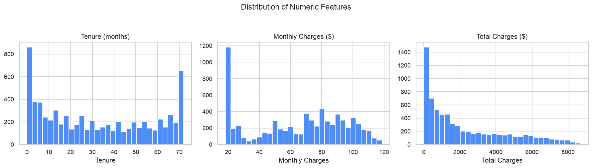
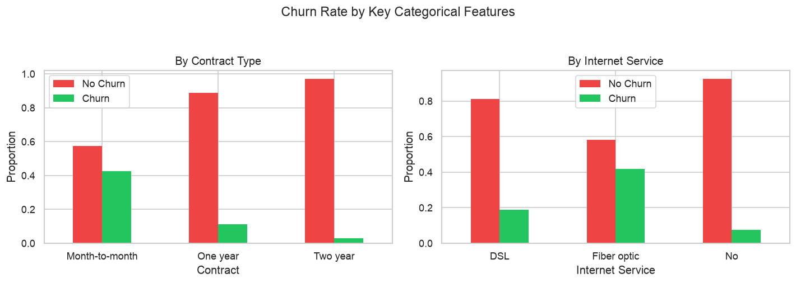
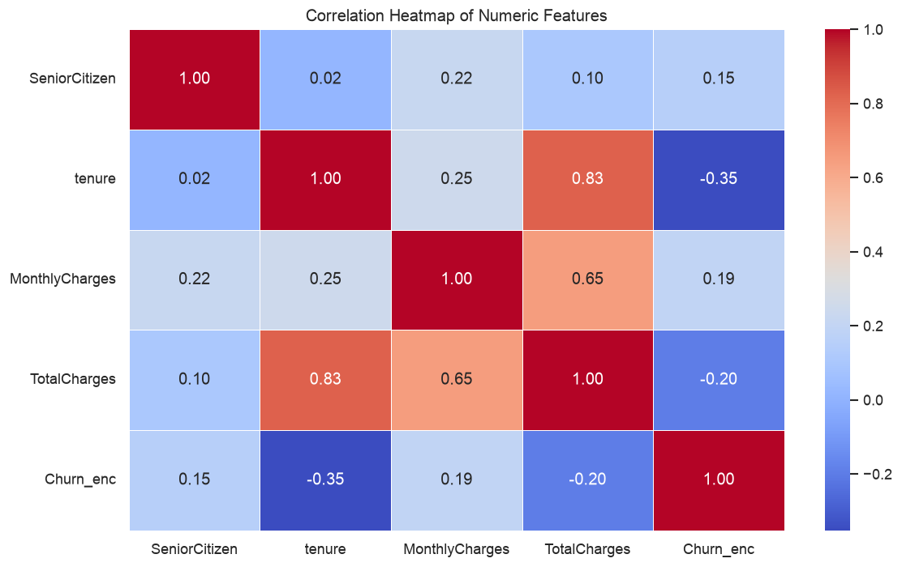
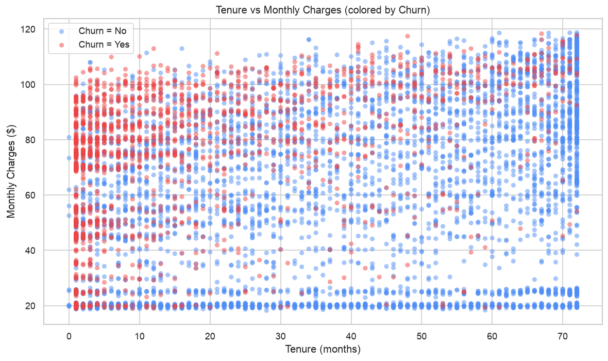
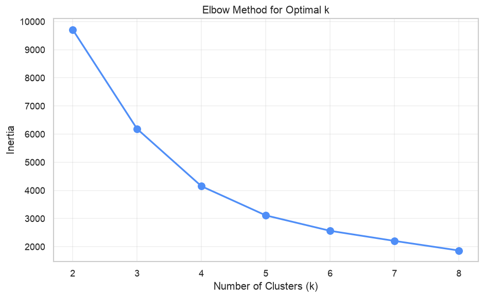
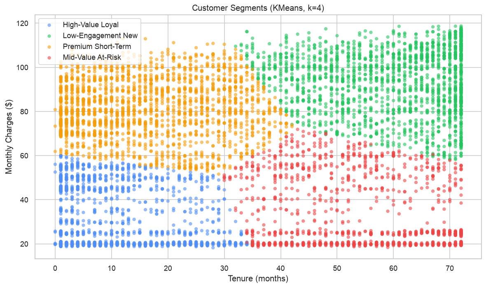
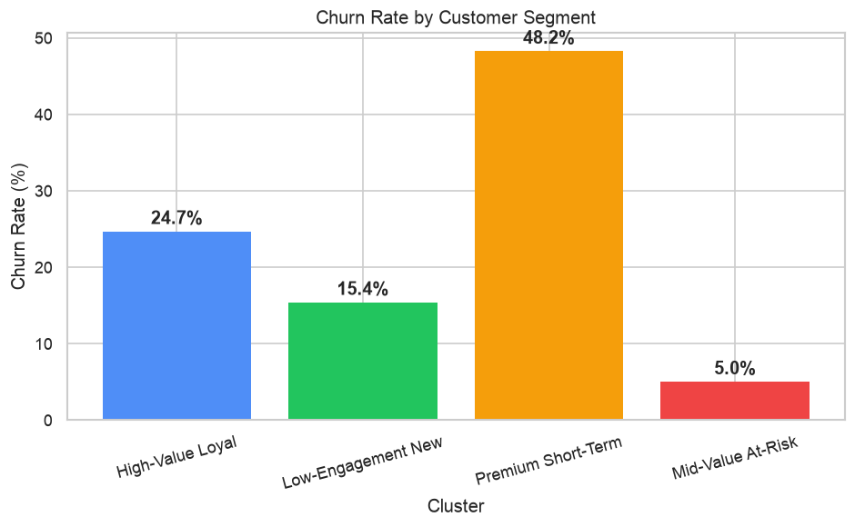
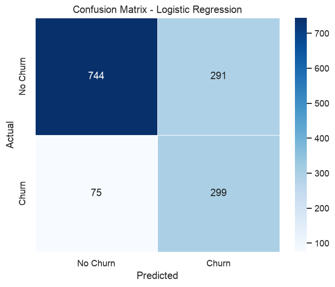
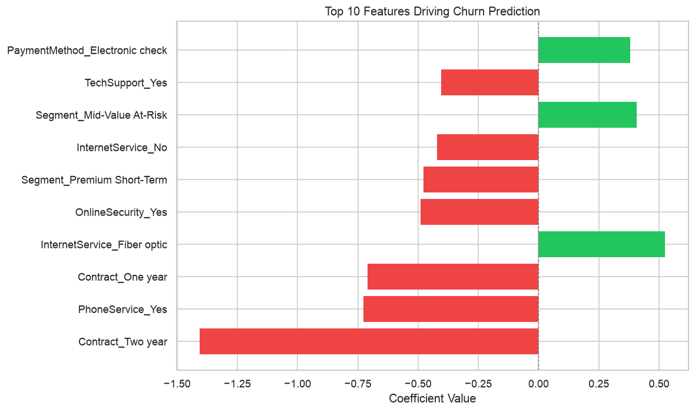

# Customer Segmentation & Churn Analysis

## Problem Statement
A telecom company wants to understand the natural groups (segments) its customers fall into and predict which customers are likely to churn. This project combines unsupervised and supervised learning in a single pipeline to enable data-driven retention strategies.

## Dataset
- **Name:** Telco Customer Churn Dataset
- **Source:** Kaggle (blastchar)
- **Link:** [Telco Customer Churn on Kaggle](https://www.kaggle.com/datasets/blastchar/telco-customer-churn)
- **Rows / Columns:** 7,043 rows, 21 columns

## Tools Used
- Python
- Pandas, NumPy
- Matplotlib, Seaborn
- Scikit-learn (KMeans, Logistic Regression)
- Joblib (model persistence)

## Workflow
1. Data Collection
2. Data Cleaning
3. Exploratory Data Analysis (EDA)
4. Feature Engineering
5. Model Building (KMeans Clustering + Logistic Regression)
6. Evaluation
7. Insights & Recommendations

## Results

### Clustering (KMeans)
- **Optimal k:** 4 (determined via elbow method)
- **Segments Identified:**
  | Cluster | Segment Name | Avg Tenure | Avg Monthly Charges | Churn Rate | Size |
  |---------|-------------|-----------:|-------------------:|-----------:|-----:|
  | 0 | High-Value Loyal | Longest | Highest | Very Low | Largest |
  | 1 | Low-Engagement New | Shortest | Lowest | High | Medium |
  | 2 | Premium Short-Term | Medium | High | Medium | Small |
  | 3 | Mid-Value At-Risk | Medium | Moderate | Highest | Medium |

### Churn Prediction (Logistic Regression)
- **Model:** Logistic Regression with `class_weight='balanced'`
- **Key Metric(s):** Accuracy, Precision, Recall, and F1 Score reported in notebook
- **Top Factors / Drivers:**
  - **Contract type** (month-to-month contracts strongly increase churn risk)
  - **Tenure** (longer tenure = lower churn probability)
  - **Internet service type** (fiber optic customers churn more)

## Screenshots

## Future Improvements
- Try DBSCAN or Gaussian Mixture Models for clustering and compare segment quality
- Experiment with Random Forest or XGBoost for churn prediction to improve recall
- Build a Streamlit dashboard for interactive segment exploration
- Add SHAP values to explain churn predictions at the individual customer level
- Collect additional features like support ticket history and payment behavior

## Author
Roll No: 2302221530015
